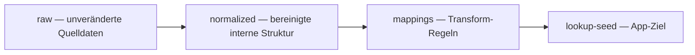

# DBRD-Datenfluss (Kontext)

**Stand:** Platzhalter-Dokument — beschreibt die beabsichtigte Datenpipeline im Monorepo, ohne App- oder Domain-Code zu ersetzen.

## Zielbild

Die **Mobile-App** liest strukturierte Lookup-Daten aus **`data/lookup-seed/`** (JSON + Manifest). Dieses Verzeichnis bleibt das **kanonische Ziel** für gebündelte App-Inhalte im aktuellen Produktstand.

DBRD-bezogene Inhalte werden **nicht** ad hoc in diesen Seed-Dateien editiert, sondern über eine nachvollziehbare Kette aus Rohdaten, Normalisierung und Mapping.

## Stufen

| Stufe | Ort im Repo | Bedeutung |
|-------|-------------|-----------|
| Rohdaten | `data/dbrd-source/raw/` | Unveränderte Quelle (Exporte, Lieferungen). Dokumentation der Herkunft, keine fachliche Bereinigung an dieser Stelle. |
| Normalisiert | `data/dbrd-source/normalized/` | Interne, validierbare Repräsentation nach Parsing, Einheitlichkeit von Feldern, Duplikaten etc. |
| Mappings | `data/dbrd-source/mappings/` | Transformation von der normalisierten Struktur in das **Schema der Lookup-Seeds** (Felder, IDs, Manifest-Einträge). |
| Lookup-Seed | `data/lookup-seed/` | **Ziel für die App** — nur hier liegen die JSONs, die gebündelt oder zur Laufzeit geladen werden. |

## Skripte und Schemata

- **Skripte:** `scripts/dbrd/` — Orchestrierung der Schritte (Einlesen, Normalisieren, Mappen, Schreiben des Seeds).
- **Schemata:** `data/schemas/` — JSON-Schema oder vergleichbare Definitionen für Seeds und Zwischenformate, sobald festgelegt.

## Governance-Regel

**Keine direkte Bearbeitung produktiver App-JSONs** unter `data/lookup-seed/` ohne einen definierten Transform-Schritt. So bleiben Quelle, Normalisierung und App-Ziel **rückverfolgbar** und wiederholbar.

## Abgrenzung

- Dieses Dokument beschreibt **Datenfluss und Repo-Orte**, nicht Domain-Entities oder App-Architektur.
- Änderungen an Fachmodellen oder Mobile-Code sind **nicht** Teil dieser Pipeline-Dokumentation; sie erfolgen in den jeweiligen Modulen nach den Projektregeln.

## Siehe auch

- `data/dbrd-source/README.md`
- `data/dbrd-source/mappings/README.md`
- `scripts/dbrd/README.md`
